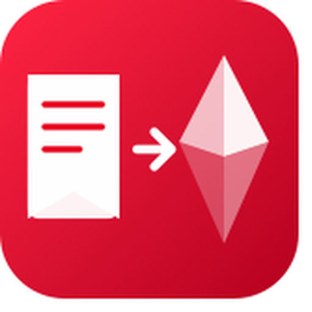
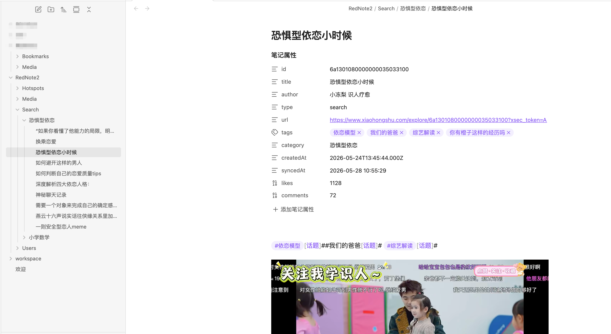
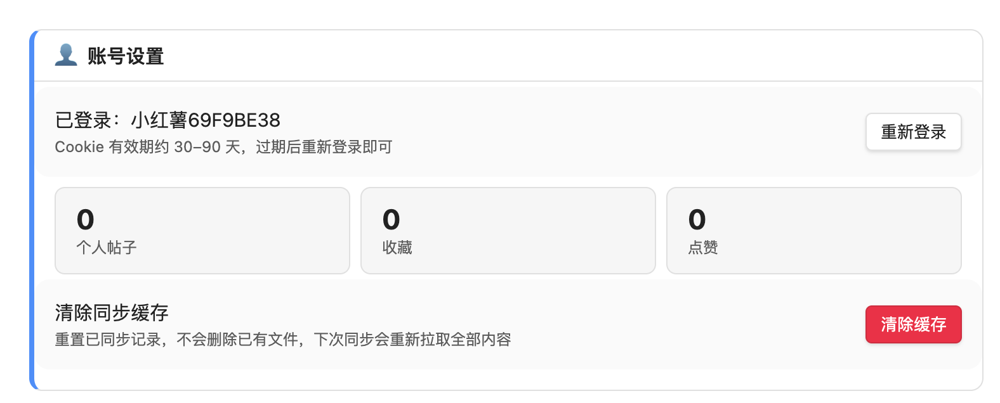
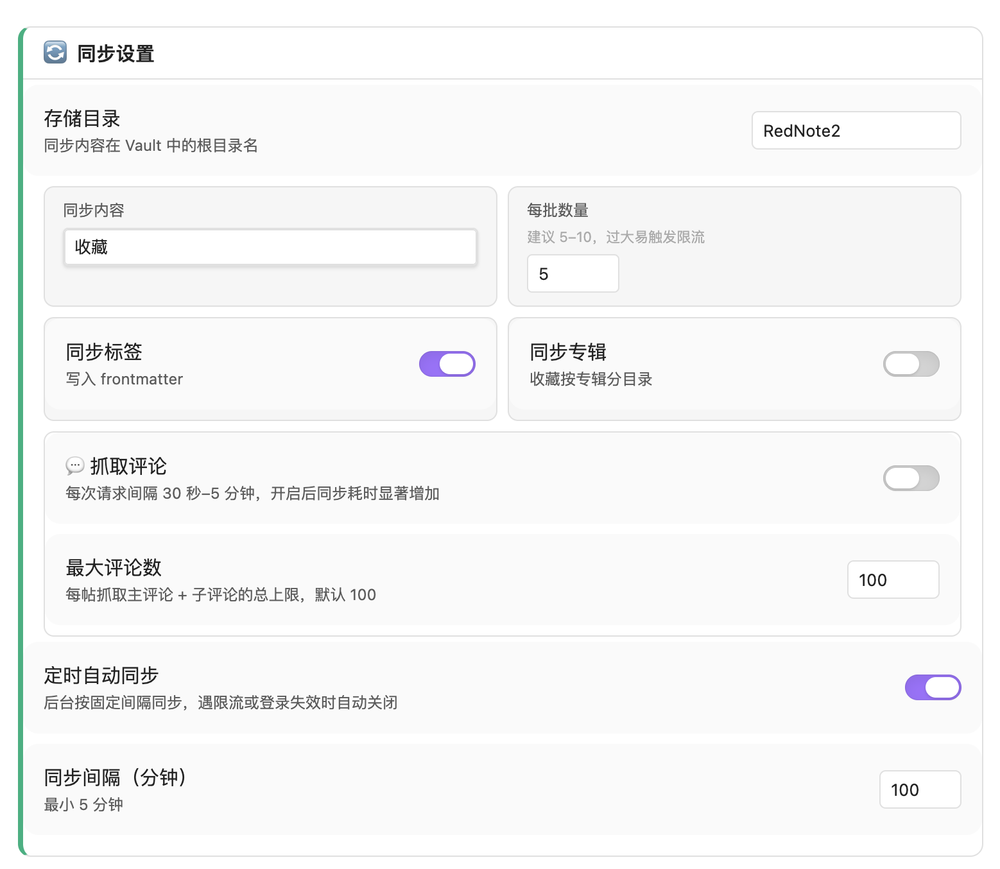
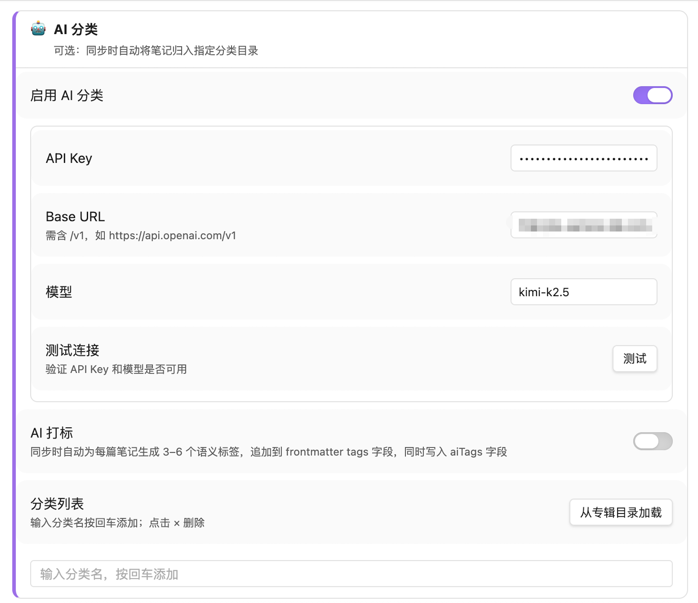
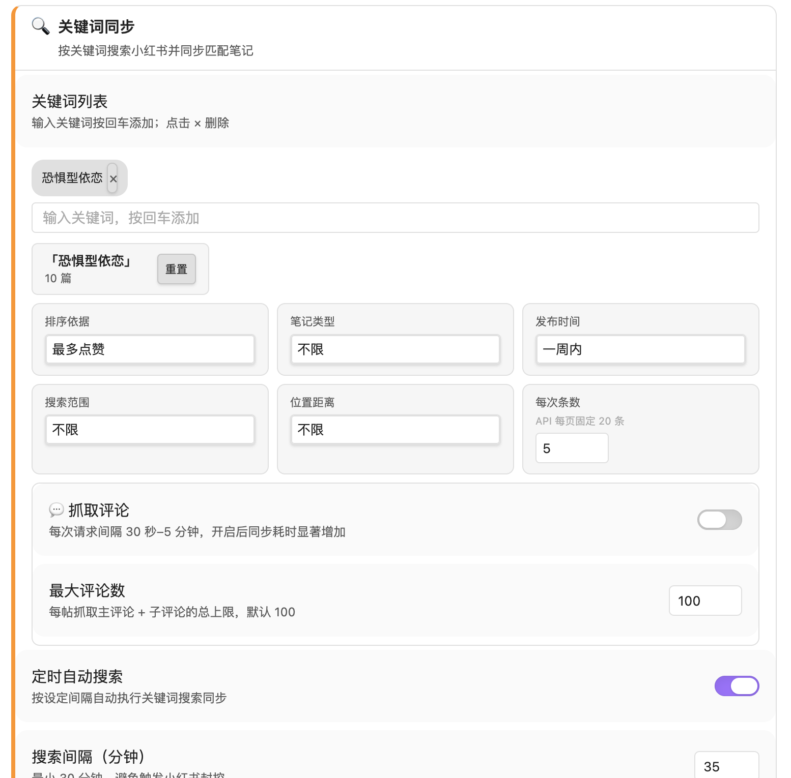
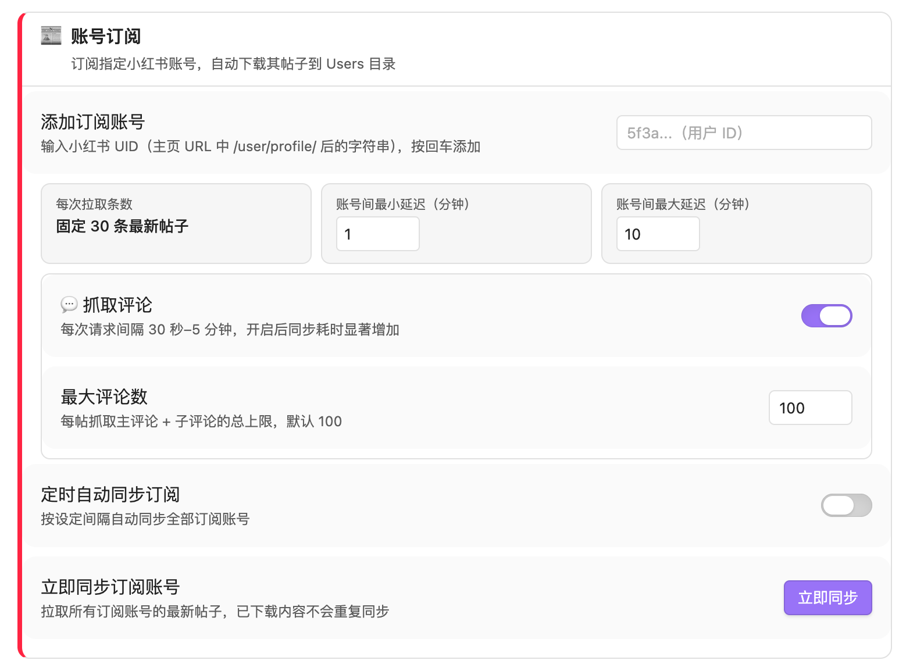
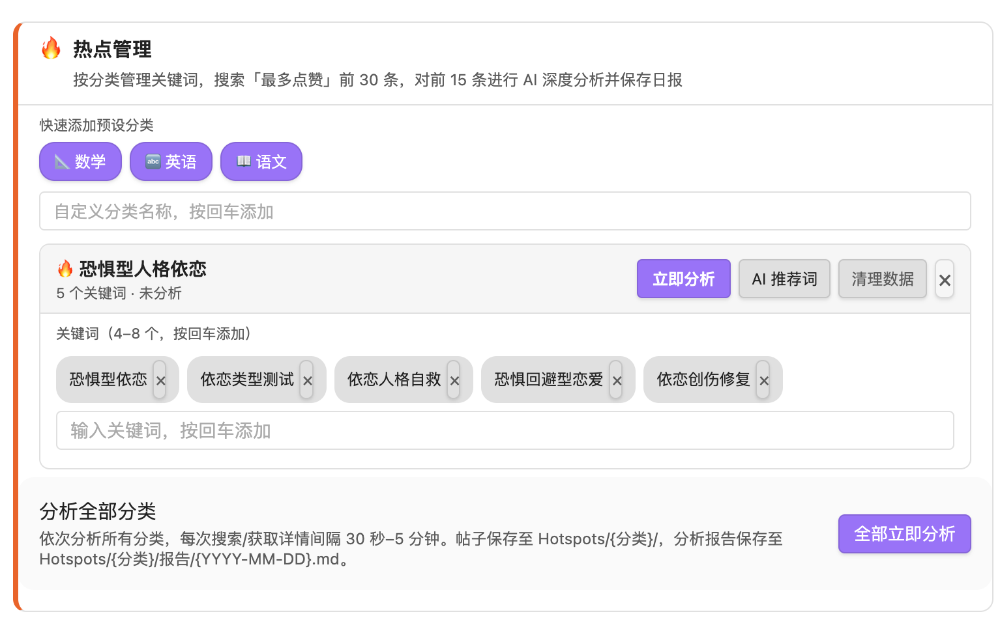

<p align="center">
  
</p>

<h1 align="center">XHS Sync · 小红书 → Obsidian</h1>

<p align="center">
  将小红书的<strong>收藏、点赞、帖子、搜索结果、订阅账号</strong>一键同步到 Obsidian<br/>
  图片/视频本地化 · AI 智能分类 · 热点分析日报 · 全程自动化<br/><br/>
  Sync Xiaohongshu (RedNote) bookmarks, likes, posts, searches and followed accounts to Obsidian — with media, AI tagging and hotspot reports.
</p>

<p align="center">
  <a href="https://github.com/ytf606/xhs2obsidian/releases/latest">
    
  </a>
  <a href="https://github.com/ytf606/xhs2obsidian/blob/main/LICENSE">
    
  </a>
  
  
</p>

<p align="center">
  <a href="#中文说明">中文</a> · <a href="#english">English</a>
</p>

<p align="center">
  
</p>

---

## 中文说明

### ✨ 功能一览

| 功能 | 说明 |
|------|------|
| 📚 **五类内容同步** | 收藏 · 点赞 · 个人帖子 · 关键词搜索 · 订阅账号 |
| 🖼️ **媒体本地化** | 图片和视频自动下载，离线永久可查 |
| 🤖 **AI 智能分类** | 接入任意 OpenAI 兼容 API，自动归入自定义分类目录 |
| 🏷️ **AI 自动打标** | 每篇笔记生成 3–6 个语义标签写入 frontmatter |
| 🔥 **热点分析日报** | 按分类抓取最热内容，AI 深度分析爆款因素，生成日报 |
| 📰 **账号订阅** | 订阅指定博主，定时拉取最新帖子 |
| 💬 **评论抓取** | 可选同步主评论 + 子评论，设置抓取上限 |
| ⏱️ **定时自动同步** | 后台定时运行，新内容自动入库 |
| 🔄 **增量同步** | 记录已同步 ID，不重复拉取 |
| 📁 **专辑目录** | 收藏夹按专辑自动分子目录 |
| 📝 **结构化笔记** | frontmatter 记录 id、author、tags、likes、comments 等完整元数据 |

---

### 📸 界面预览

<table>
<tr>
<td width="50%">
<b>账号设置</b> — 登录状态 · 同步统计 · 缓存管理<br/>

</td>
<td width="50%">
<b>同步设置</b> — 目录 · 批量 · 标签 · 评论 · 定时<br/>

</td>
</tr>
<tr>
<td width="50%">
<b>AI 分类</b> — 支持 OpenAI / Kimi / DeepSeek 等<br/>

</td>
<td width="50%">
<b>关键词同步</b> — 多词 · 筛选 · 定时自动搜索<br/>

</td>
</tr>
<tr>
<td width="50%">
<b>账号订阅</b> — UID 订阅 · 随机延迟 · 评论同步<br/>

</td>
<td width="50%">
<b>热点管理</b> — 分类关键词 · AI 推词 · 一键分析<br/>

</td>
</tr>
</table>

---

### 🗂️ Vault 文件结构

同步后在 Obsidian Vault 中自动生成：

```
RedNote/
├── Bookmarks/              # 收藏的笔记
│   ├── [专辑名]/           # 开启"同步专辑"后按专辑分组
│   └── 笔记标题.md
├── Posts/                  # 个人发布的帖子
├── Likes/                  # 点赞的帖子
├── Search/
│   └── [关键词]/           # 每个关键词独立目录
│       └── 笔记标题.md
├── Users/
│   └── [博主昵称]/
│       ├── _profile.md     # 博主主页档案
│       └── 笔记标题.md
├── Hotspots/
│   └── [分类名]/
│       ├── 笔记标题.md
│       └── 报告/
│           └── 2026-05-28.md   # AI 热点日报
└── Media/
    ├── 笔记标题/           # 每篇笔记独立媒体文件夹
    │   ├── 1.jpg
    │   └── video.mp4
    └── avatars/            # 评论头像
```

每篇笔记的 Markdown 示例：

```markdown
---
id: "6a1301080000000035033100"
title: "恐惧型依恋小时候"
author: "小冻梨 认人疗愈"
type: search
url: "https://www.xiaohongshu.com/explore/6a130108..."
tags: [依恋模型, 我们的爸爸, 综艺解读]
aiTags: [依恋理论, 情感疗愈, 亲子关系]
category: "恐惧型依恋"
createdAt: "2026-05-24T13:45:44.000Z"
syncedAt: "2026-05-28 10:55:29"
likes: 1128
comments: 72
---

笔记正文…


```

---

### 🚀 安装

#### 方式一：从 Release 安装（推荐）

1. 前往 [**Releases**](https://github.com/ytf606/xhs2obsidian/releases/latest) 下载最新 `xhs2obsidian-x.x.x.zip`
2. 解压后将文件夹复制到 Vault 的 `.obsidian/plugins/` 目录
3. Obsidian → **设置 → 第三方插件** → 关闭「安全模式」→ 刷新列表 → 启用 **XHS Sync**

#### 方式二：从源码构建

```bash
git clone https://github.com/ytf606/xhs2obsidian.git
cd xhs2obsidian
npm install
npm run build
# 将 main.js、manifest.json、styles.css 复制到 Vault/.obsidian/plugins/xhs2obsidian/
```

> **注意：** 本插件依赖 Electron WebView，仅支持 Obsidian **桌面端**（macOS / Windows / Linux）。

---

### 📖 快速开始

#### 第一步：登录小红书

1. Obsidian → **设置 → XHS Sync**
2. 点击「**登录**」→ 在内置浏览器中完成扫码 / 手机号登录
3. 登录后点击「**登录完成，提取 Cookie**」
4. 状态栏显示「已登录：你的昵称」即成功

> Cookie 有效期约 30–90 天，过期后重新登录即可，不影响已同步笔记。

#### 第二步：选择同步内容

在设置中选择同步目标（收藏 / 点赞 / 个人帖子），或配置关键词搜索、账号订阅。

#### 第三步：开始同步

| 方式 | 操作 |
|------|------|
| 快速同步 | 点击左侧 Ribbon 栏云下载图标 |
| 命令面板 | `Cmd/Ctrl+P` → 搜索「同步收藏 / 同步点赞 / 关键词搜索…」|
| 自动同步 | 在设置中开启「定时自动同步」 |

同步进度以通知气泡实时显示，完成后提示新增条数。

---

### ⚙️ 主要配置项

#### 同步设置

| 设置项 | 默认值 | 说明 |
|--------|--------|------|
| 存储目录 | `RedNote` | Vault 内根目录名 |
| 同步内容 | 收藏 | Ribbon 图标触发的同步类型 |
| 每批数量 | 5 | 每次 API 请求条目数，建议 5–10 |
| 同步标签 | 开启 | 将小红书话题标签写入 frontmatter |
| 同步专辑 | 关闭 | 收藏夹按专辑分子目录 |
| 抓取评论 | 关闭 | 同步主评论及子评论 |
| 最大评论数 | 100 | 每帖主评论 + 子评论总上限 |
| 定时自动同步 | 关闭 | 后台按间隔自动同步 |
| 同步间隔 | 10 分钟 | 建议 ≥ 10 分钟 |

#### AI 分类

配置任意 OpenAI 兼容 API（OpenAI / Kimi / DeepSeek / OpenRouter 等）后，同步时自动将笔记归入自定义分类目录，并可开启 AI 打标（每篇生成 3–6 个语义标签）。

#### 关键词搜索

| 设置项 | 说明 |
|--------|------|
| 关键词列表 | 多关键词，每个独立目录，支持增量 |
| 排序方式 | 综合 / 最新 / 最多点赞 / 评论数 / 收藏数 |
| 笔记类型 | 不限 / 视频 / 图文 |
| 时间范围 | 不限 / 一天 / 一周 / 半年 |
| 定时自动搜索 | 按间隔自动执行，新增内容自动入库 |

#### 账号订阅

输入博主主页 URL 中 `/user/profile/` 后的 UID，每次拉取最新 30 条帖子，支持随机延迟避免触发限流。

#### 热点管理

按分类维护关键词列表（4–8 个/分类），一键触发：搜索最多点赞前 30 条 → AI 深度分析前 15 条爆款因素 → 生成结构化日报保存至 `Hotspots/[分类]/报告/YYYY-MM-DD.md`。

---

### ❓ 常见问题

**Q：同步时提示「请先登录」**  
Cookie 已过期，点击「重新登录」完成一次登录即可。

**Q：同步一段时间后报错停止**  
触发了小红书频率限制。将「每批数量」调小至 3–5，等待几分钟后重试。

**Q：图片或视频没有下载**  
小红书媒体链接有时效性，建议尽快同步。清除缓存后重新同步可重试失败项。

**Q：如何从头重新同步所有内容**  
设置 → 账号设置 → 点击「清除缓存」，下次同步将重新拉取全部内容。

**Q：定时同步被自动关闭了**  
遇到限流或 Cookie 失效时插件会自动关闭定时同步以保护账号，处理后在设置中重新开启。

---

## English

### ✨ Features

| Feature | Description |
|---------|-------------|
| 📚 **5 content types** | Bookmarks · Likes · Posts · Keyword search · Account subscriptions |
| 🖼️ **Local media** | Images and videos downloaded locally for offline access |
| 🤖 **AI classification** | Auto-categorize notes into custom folders via any OpenAI-compatible API |
| 🏷️ **AI tagging** | Generate 3–6 semantic tags per note, written to frontmatter |
| 🔥 **Hotspot reports** | Fetch top-liked content by category, AI-analyzes viral factors, saves daily report |
| 📰 **Account subscriptions** | Follow XHS creators by UID, sync latest posts automatically |
| 💬 **Comment sync** | Optionally sync top-level and sub-comments with configurable limits |
| ⏱️ **Auto sync** | Background timer-based sync, pauses on rate-limit or auth failure |
| 🔄 **Incremental sync** | Tracks synced IDs to avoid duplicates |
| 📝 **Structured notes** | Frontmatter with id, author, tags, aiTags, category, likes, comments |

### 🚀 Installation

#### Option 1: Download Release (Recommended)

1. Download the latest `xhs2obsidian-x.x.x.zip` from [**Releases**](https://github.com/ytf606/xhs2obsidian/releases/latest)
2. Extract and copy the folder to your Vault's `.obsidian/plugins/` directory
3. Obsidian → **Settings → Community plugins** → Disable safe mode → Refresh → Enable **XHS Sync**

#### Option 2: Build from Source

```bash
git clone https://github.com/ytf606/xhs2obsidian.git
cd xhs2obsidian
npm install
npm run build
# Copy main.js, manifest.json, styles.css to Vault/.obsidian/plugins/xhs2obsidian/
```

> **Note:** This plugin requires Electron WebView and only works on Obsidian **desktop** (macOS / Windows / Linux).

### 📖 Quick Start

1. **Login** — Settings → XHS Sync → **Login** → complete login in the built-in browser → click **Extract Cookie**
2. **Configure** — Choose sync target, add keywords, or subscribe to accounts
3. **Sync** — Click the cloud icon in the ribbon, or use the command palette (`Cmd/Ctrl+P`)

### ⚙️ Configuration

| Setting | Default | Description |
|---------|---------|-------------|
| Root folder | `RedNote` | Storage directory in your vault |
| Sync target | Bookmarks | What to sync via ribbon icon |
| Batch size | 5 | Items per API request (5–10 recommended) |
| Sync tags | On | Write hashtags to frontmatter |
| Sync albums | Off | Organize bookmarks into album sub-folders |
| Fetch comments | Off | Sync comments and replies per note |
| Auto sync | Off | Background sync at a fixed interval |
| Sync interval | 10 min | Minimum 10 minutes recommended |
| AI classify | Off | Requires OpenAI-compatible API credentials |

### ❓ FAQ

**Q: "Please login first" error**  
Your cookie has expired. Click "Re-login" in settings to refresh.

**Q: Sync stops with a rate-limit error**  
Reduce batch size to 3–5 and wait a few minutes before retrying.

**Q: Images or videos are missing**  
XHS media URLs expire quickly. Sync soon after saving content. Clear cache to retry failed downloads.

---

## 🤝 Contributing

Issues and PRs are welcome! Please read [CONTRIBUTING.md](CONTRIBUTING.md) before submitting.

## ⚠️ Disclaimer

This plugin is not affiliated with or endorsed by Xiaohongshu (小红书). It accesses only your own personal data via the web interface. Use responsibly and in compliance with Xiaohongshu's Terms of Service.

## 📄 License

[MIT](LICENSE) © ytf606
